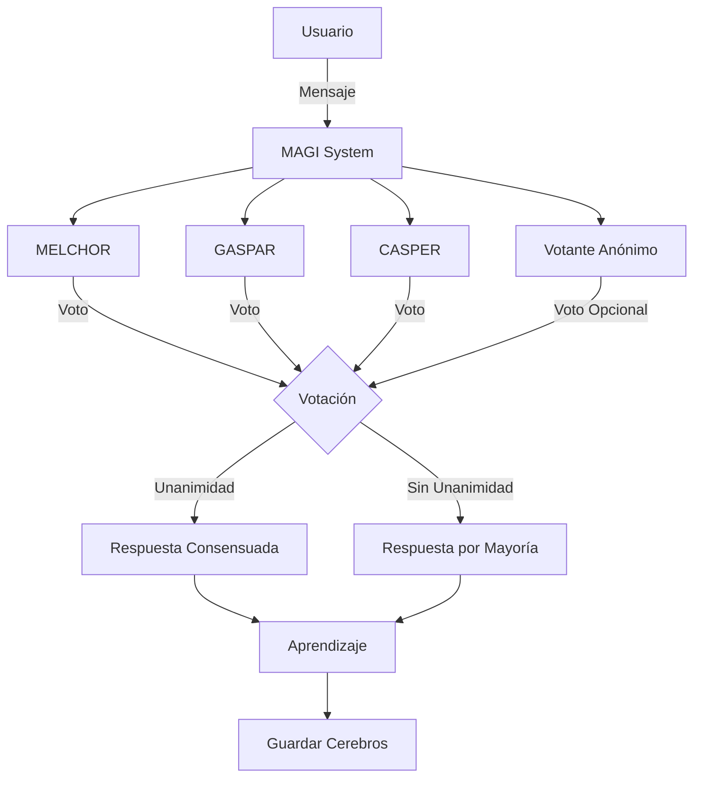

# 🧠 MAGI System - Multi-Agent General Intelligence

<div align="center">


**Un sistema de inteligencia artificial inspirado en NERV que utiliza tres cerebros neuronales independientes con votación democrática para generar respuestas consensuadas.**

[Características](#-características) • [Instalación](#-instalación) • [Uso](#-uso) • [Arquitectura](#-arquitectura) • [Contribuir](#-contribuir)

</div>

---

## 🌟 Características

### 🎯 Sistema de Tres Cerebros
- **MELCHOR**: Cerebro analítico y preciso
- **GASPAR**: Cerebro creativo y exploratorio  
- **CASPER**: Cerebro escéptico con aleatoriedad controlada
- **Votante Anónimo**: Cuarto votante opcional con decisiones aleatorias

### 🧠 Aprendizaje Continuo
- **Crecimiento Infinito**: Las redes neuronales se expanden automáticamente cada 500 caracteres procesados
- **Optimizador Adam**: Aprendizaje adaptativo de alta eficiencia
- **Entrenamiento Multi-Época**: 
  - Chat: 3 épocas para respuestas rápidas
  - Archivos (PDF/TXT): 5 épocas para aprendizaje profundo
  - Videos: 1 época para velocidad

### 💤 Sistema de Sueño (Consolidación de Memoria)
Inspirado en el sueño REM humano:
- **Poda de Conexiones Débiles**: Elimina el 1% de conexiones más débiles
- **Refuerzo de Conexiones Importantes**: Fortalece el 10% superior en un 10%
- **Regularización L2**: Previene sobreajuste
- **Normalización de Sesgos**: Estabiliza el comportamiento

### 📚 Múltiples Fuentes de Aprendizaje
- 📄 **Archivos de Texto** (.txt)
- 📁 **Carpetas de Texto** (procesamiento masivo)
- 📕 **Documentos PDF** (extracción inteligente)
- 🎬 **Videos/Audio** (transcripción con Whisper)
- 📂 **Carpetas de Videos** (procesamiento por lotes)
- 💬 **Chat Interactivo** (aprendizaje en tiempo real)

### 🎨 Interfaz Moderna
- Diseño inspirado en ChatGPT con tema oscuro
- Animación de ADN en tiempo real
- Feedback detallado de entrenamiento
- Indicadores de estado de cerebros
- Barra de progreso en tiempo real

---

## 🚀 Instalación

### Requisitos Previos
- Python 3.8 o superior
- pip (gestor de paquetes de Python)

### Instalación Rápida

```bash
# Clonar el repositorio
git clone https://github.com/tu-usuario/MAGI.git
cd MAGI

# Instalar dependencias
pip install -r requirements.txt

# Ejecutar MAGI
cd src
python3 gui_magi_refactored.py
```

### Dependencias Principales

```txt
PySide6>=6.4.0          # Interfaz gráfica
numpy>=1.24.0           # Computación numérica
PyMuPDF>=1.23.0         # Procesamiento de PDF
openai-whisper>=20230314 # Transcripción de audio/video
torch>=2.0.0            # Backend de Whisper
```

---

## 💻 Uso

### Inicio Rápido

1. **Ejecutar la aplicación**:
```bash
cd src
python3 gui_magi_refactored.py
```

2. **Chat Interactivo**:
   - Escribe tu mensaje en el campo de entrada
   - Presiona Enter o click en ➡️
   - MAGI deliberará y responderá por consenso

3. **Entrenar con Archivos**:
   - Click en **📄 Text** para archivos .txt
   - Click en **📕 PDF** para documentos PDF
   - Click en **🎬 Video** para transcribir y aprender de videos
   - Click en **📁 TXT Folder** para procesar carpetas completas

4. **Modo de Sueño**:
   - Click en **💤 Sleep Mode** después de sesiones largas
   - Consolida la memoria y optimiza las conexiones
   - Mejora la calidad de respuestas futuras

### Configuración de Cerebros

Puedes activar/desactivar cerebros individualmente:
- ✅ **Checkbox verde**: Cerebro activo (participa en votaciones)
- ⚫ **Checkbox gris**: Cerebro inactivo (no participa)

### Votante Anónimo

Activa el votante anónimo para:
- Romper empates en votaciones
- Añadir aleatoriedad controlada
- Explorar respuestas alternativas

---

## 🏗️ Arquitectura

### Estructura del Proyecto

```
MAGI/
├── src/
│   ├── gui_magi_refactored.py    # Interfaz principal
│   ├── chat_interactivo.py        # Red neuronal base
│   ├── core/
│   │   ├── brain_manager.py       # Gestor de cerebros
│   │   └── signals.py             # Señales Qt
│   ├── ui/
│   │   ├── widgets.py             # Widgets personalizados
│   │   └── styles.py              # Estilos CSS
│   └── utils/
│       └── __init__.py
├── melchor.pkl                    # Cerebro MELCHOR
├── gaspar.pkl                     # Cerebro GASPAR
├── casper.pkl                     # Cerebro CASPER
└── README.md
```

### Flujo de Procesamiento



### Red Neuronal

Cada cerebro es una red neuronal de 2 capas:
- **Capa de Entrada**: Vocabulario completo (caracteres)
- **Capa Oculta**: Tanh activation (128+ neuronas, crece dinámicamente)
- **Capa de Salida**: Softmax sobre vocabulario
- **Optimizador**: Adam con β₁=0.9, β₂=0.999
- **Learning Rate**: 0.001

---

## 🧪 Características Técnicas

### Optimizaciones de Rendimiento

- **Procesamiento por Lotes**: Forward pass vectorizado
- **Indexación Directa**: Evita one-hot encoding
- **Threading**: Operaciones de I/O en hilos separados
- **Guardado Incremental**: Checkpoints automáticos durante entrenamiento
- **Soporte M1/M2/M3/M4**: Optimizado para Apple Silicon (MPS)

### Consolidación de Memoria (Sueño)

El sistema de sueño implementa:

1. **Poda Sináptica**: Elimina conexiones débiles (< percentil 1%)
2. **Potenciación a Largo Plazo**: Refuerza conexiones fuertes (> percentil 90%)
3. **Regularización**: Decay del 0.05% para prevenir sobreajuste
4. **Estabilización**: Normalización de sesgos entre [-2, 2]

### Procesamiento de Archivos

#### Archivos de Texto
- División inteligente por párrafos
- Bloques de ~1000 caracteres
- 5 épocas de entrenamiento
- Guardado cada 100 bloques

#### PDFs
- Extracción de texto por página
- Limpieza de líneas cortas (< 10 caracteres)
- Reconstrucción de párrafos
- 5 épocas de entrenamiento
- Guardado cada 50 bloques

#### Videos/Audio
- Transcripción con Whisper (modelo base)
- Soporte para: MP4, MKV, AVI, MOV, MP3, WAV
- Procesamiento en chunks de 2000 caracteres
- Guardado automático de transcripciones
- Optimizado para MPS (Apple Silicon)

---

## 📊 Estadísticas y Monitoreo

La interfaz muestra en tiempo real:
- 🧠 **Neuronas por cerebro**: Crecimiento dinámico
- 💾 **Memoria total**: Tamaño en MB de los tres cerebros
- 📈 **Progreso de entrenamiento**: Barra visual
- 🔴 **Estado de cerebros**: Activo/Inactivo
- 🟣 **Votante anónimo**: Activo/Inactivo

---

## 🎯 Casos de Uso

### 1. Asistente Personal
Entrena MAGI con tus documentos personales para crear un asistente que conoce tu contexto.

### 2. Base de Conocimiento
Procesa bibliotecas completas de documentación técnica para consultas especializadas.

### 3. Análisis de Contenido
Transcribe y analiza videos educativos o conferencias automáticamente.

### 4. Chatbot Personalizado
Crea un chatbot con personalidad única basado en corpus de texto específico.

---

## 🔧 Configuración Avanzada

### Ajustar Épocas de Entrenamiento

En `brain_manager.py`:

```python
# Archivos de texto
ia.aprender(bloque, epocas=5)  # Cambiar a 3-10

# Chat interactivo
ia.aprender(texto)  # Usa default de 3 épocas
```

### Modificar Parámetros de Sueño

```python
ia.dormir(
    umbral_poda=0.01,      # 1% más débil (0.01-0.05)
    factor_refuerzo=1.1    # 10% refuerzo (1.05-1.2)
)
```

### Cambiar Tasa de Expansión

En `chat_interactivo.py`:

```python
def expandir_cerebro(self):
    incremento = 64  # Cambiar a 32-128
```

---

## 🐛 Solución de Problemas

### Error: "command not found: python"
```bash
# Usar python3 en su lugar
python3 gui_magi_refactored.py
```

### Error: Whisper no encuentra el dispositivo MPS
```bash
# El sistema automáticamente fallback a CPU
# No requiere acción
```

### Los cerebros no crecen
- Verifica que estés procesando al menos 500 caracteres
- Revisa que los cerebros estén activos (checkbox verde)

### Respuestas inconsistentes
- Ejecuta **💤 Sleep Mode** para consolidar memoria
- Entrena con más datos relevantes
- Considera desactivar el votante anónimo

---

## 🤝 Contribuir

¡Las contribuciones son bienvenidas! Por favor:

1. Fork el proyecto
2. Crea una rama para tu feature (`git checkout -b feature/AmazingFeature`)
3. Commit tus cambios (`git commit -m 'Add some AmazingFeature'`)
4. Push a la rama (`git push origin feature/AmazingFeature`)
5. Abre un Pull Request

---

## 📝 Licencia

Este proyecto está bajo la Licencia MIT. Ver `LICENSE` para más detalles.

---

## 🙏 Agradecimientos

- Inspirado en el sistema MAGI de Neon Genesis Evangelion
- Whisper de OpenAI para transcripción de audio
- PySide6 para la interfaz gráfica
- La comunidad de Python y Machine Learning

---

## 📧 Contacto

Raúl Díaz - [@tu_twitter](https://twitter.com/tu_twitter)

Link del Proyecto: [https://github.com/tu-usuario/MAGI](https://github.com/tu-usuario/MAGI)

---

<div align="center">

**Hecho con 🧠 y ☕ por Raúl Díaz**

⭐ Si te gusta este proyecto, ¡dale una estrella en GitHub! ⭐

</div>
